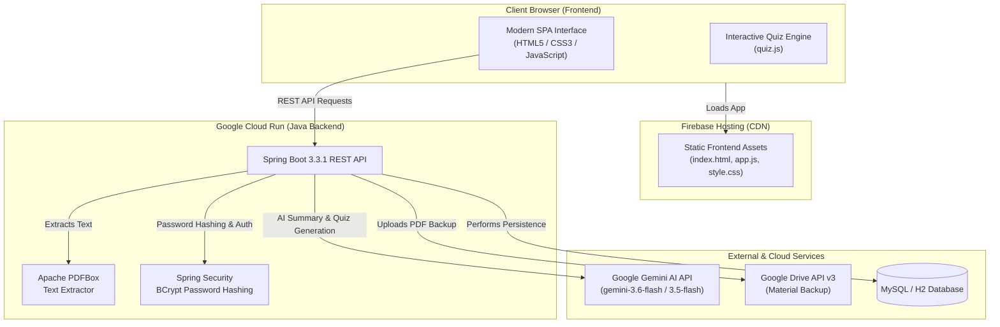

# 🎓 Academic Material Summarizer & Quiz Generator

[](https://spring.io/projects/spring-boot)
[](https://www.oracle.com/java/)
[](https://ai.google.dev/)
[](https://cloud.google.com/run)
[](https://firebase.google.com/)
[](https://www.docker.com/)

An **AI-Powered Academic Platform** designed to automate exam preparation and study note creation. Students and educators can upload academic materials (PDFs), and the system automatically extracts document content, backs up files to **Google Drive**, and leverages **Google Gemini AI** to generate concise, structured study summaries and interactive practice quizzes.

---

## 📸 Overview & Key Features


### 🌟 Core Functionality
- 📄 **PDF Material Upload & Ingestion**: Drag-and-drop or select PDF course documents and lecture slides. Includes text extraction powered by **Apache PDFBox** with fallback to direct PDF byte streams for Gemini multimodal analysis.
- ☁️ **Cloud Storage Backup**: Automatic, background synchronization of uploaded materials to **Google Drive** via Google Drive API v3 (OAuth2 service account / refresh tokens).
- 🧠 **AI-Powered Summary Generation**: Instant creation of structured study summaries complete with section breakdowns (*Key Academic Concepts*, *Detailed Analysis*, and *Important Rules & Constraints*) formatted in clean Markdown.
- 🎯 **Interactive Multiple-Choice Quizzes**: Dynamically generates practice quizzes with configurable question counts, instant answer validation, real-time score tracking, detailed step-by-step explanations, and retake functionality.
- 🔐 **User Authentication & State Persistence**: Secure user registration and login utilizing **Spring Security** with **BCrypt** password hashing, coupled with local storage session management.
- 🗄️ **Dual Database Architecture**: Zero-configuration in-memory **H2 Database** for fast local development and testing, seamlessly switching to **MySQL** in production environments.
- 🐳 **Production-Ready Containerization**: Optimized multi-stage Docker builds using Eclipse Temurin JDK/JRE 17 Alpine images for minimal container footprint.
- 🚀 **Automated CI/CD Pipeline**: Continuous deployment via **GitHub Actions** to **Google Cloud Run** (Java Backend) and **Firebase Hosting** (Static Frontend).

---

## 🏗️ System Architecture



---

## 🛠️ Tech Stack & Technologies

| Layer | Technology | Description |
| :--- | :--- | :--- |
| **Frontend** | HTML5, Vanilla CSS3, JavaScript (ES6+) | Modern SPA dashboard with glassmorphism dark mode theme |
| **Markdown & Formatting** | Marked.js, Highlight.js | Renders AI-generated study summaries with syntax highlighting |
| **Frontend Hosting** | Firebase Hosting | Fast global CDN distribution for static assets |
| **Backend Framework** | Spring Boot 3.3.1 (Java 17) | Microservice backend delivering RESTful endpoints |
| **Security** | Spring Security | Password hashing with BCrypt and authentication logic |
| **PDF Processing** | Apache PDFBox 3.0.1 | Extracts raw text from uploaded academic PDFs |
| **AI Integration** | Google Gemini API (`v1beta` / `v1`) | Generates study summaries and JSON-formatted quiz items |
| **Cloud Storage** | Google Drive API v3 | Uploads and syncs uploaded materials to Google Drive |
| **Database** | H2 (Dev) / MySQL 8.0 (Prod) | Relational database managed via Spring Data JPA / Hibernate |
| **Containerization** | Docker | Multi-stage Alpine container build |
| **CI/CD Pipeline** | GitHub Actions | Automated build and deployment to GCP Cloud Run & Firebase |

---

## 📂 Repository Structure

```
Academic-summarizer-system/
├── .github/
│   └── workflows/
│       ├── main.yml                     # Continuous deployment pipeline (Cloud Run & Firebase)
│       └── firebase-hosting-pull-request.yml
├── backend/                             # Java Spring Boot application
│   ├── src/
│   │   └── main/
│   │       ├── java/com/app/
│   │       │   ├── config/              # WebConfig & CORS settings
│   │       │   ├── controllers/         # AuthController, MaterialController, AiController
│   │       │   ├── dto/                 # AuthDto, MaterialDto, GenerateDto
│   │       │   ├── models/              # User, Material, GeneratedContent entities
│   │       │   └── services/            # GeminiService, GoogleDriveService, AuthService, MaterialService
│   │       └── resources/
│   │           └── application-prod.properties
│   └── pom.xml                          # Maven build setup & dependencies
├── database/
│   └── schema.sql                       # MySQL relational schema definition
├── frontend/                            # Static web frontend
│   ├── css/
│   │   └── style.css                    # Custom CSS styling and responsive layout
│   ├── js/
│   │   ├── app.js                       # SPA router, API client & state management
│   │   └── quiz.js                      # Interactive quiz rendering and scoring engine
│   └── index.html                       # Application single-page document
├── Dockerfile                           # Multi-stage Docker containerization
├── firebase.json                        # Firebase Hosting configuration
├── .firebaserc                          # Firebase project linkage
├── package.json                         # Local development HTTP server runner
└── README.md                            # Documentation
```

---

## ⚡ Quick Start & Local Development

### Prerequisites
- **Java Development Kit (JDK)**: Version 17 or higher
- **Apache Maven**: Version 3.8+
- **Node.js & npm**: Version 18+ (for running the frontend local server)
- **Google Gemini API Key**: [Obtain from Google AI Studio](https://aistudio.google.com/)

---

### 1. Clone the Repository
```bash
git clone https://github.com/DimalWithanage/Academic-summarizer-system.git
cd Academic-summarizer-system
```

---

### 2. Configure Environment Variables
Create or set the following environment variables (or configure them in `backend/src/main/resources/application.properties`):

```bash
export GEMINI_API_KEY="your_gemini_api_key_here"
export GOOGLE_DRIVE_FOLDER_ID="your_gdrive_folder_id"
export GOOGLE_DRIVE_CLIENT_ID="your_oauth_client_id"
export GOOGLE_DRIVE_CLIENT_SECRET="your_oauth_client_secret"
export GOOGLE_DRIVE_REFRESH_TOKEN="your_oauth_refresh_token"
```

> [!NOTE]
> If `GEMINI_API_KEY` is omitted or unconfigured during local execution, the system gracefully falls back to an internal intelligent document analyzer so you can test features without API rate limits.

---

### 3. Run the Backend Server
Navigating into the `backend/` directory and run via Maven:

```bash
cd backend
mvn spring-boot:run
```

The Spring Boot backend will start on **`http://localhost:8080`** using the in-memory **H2 Database**.  
You can view the H2 Console at `http://localhost:8080/h2-console` (JDBC URL: `jdbc:h2:mem:academicdb`).

---

### 4. Run the Frontend Application
In a separate terminal, start the static HTTP server from the root directory:

```bash
# From project root directory
npm run dev
```

The application will be accessible at **`http://localhost:3000`**.

---

### 🐳 Running with Docker

You can build and execute the entire containerized backend locally using Docker:

```bash
# Build the Docker image
docker build -t academic-summarizer-backend .

# Run the container
docker run -p 8080:8080 \
  -e GEMINI_API_KEY="your_gemini_api_key" \
  academic-summarizer-backend
```

---

## 🔧 Environment Variables Reference

| Variable | Description | Profile | Default |
| :--- | :--- | :--- | :--- |
| `SPRING_PROFILES_ACTIVE` | Active Spring environment profile | All | `dev` |
| `GEMINI_API_KEY` | Google Gemini AI API key | All | `YOUR_GEMINI_API_KEY` |
| `GOOGLE_DRIVE_FOLDER_ID` | Target folder ID in Google Drive | Prod/Cloud | Optional |
| `GOOGLE_DRIVE_CLIENT_ID` | OAuth2 Client ID for Google Drive API | Prod/Cloud | Optional |
| `GOOGLE_DRIVE_CLIENT_SECRET` | OAuth2 Client Secret for Google Drive API | Prod/Cloud | Optional |
| `GOOGLE_DRIVE_REFRESH_TOKEN` | OAuth2 Refresh Token for Google Drive API | Prod/Cloud | Optional |
| `SPRING_DATASOURCE_URL` | JDBC URL for MySQL database | Prod | `jdbc:mysql://...` |
| `SPRING_DATASOURCE_USERNAME` | MySQL database username | Prod | `root` |
| `SPRING_DATASOURCE_PASSWORD` | MySQL database password | Prod | `password` |

---

## 📡 REST API Reference

### 🗝️ Authentication Endpoints (`/api/auth`)

#### `POST /api/auth/register`
Registers a new user account.
- **Request Body**:
  ```json
  {
    "email": "student@university.edu",
    "password": "securePassword123"
  }
  ```
- **Response** (`200 OK`):
  ```json
  {
    "userId": 1,
    "email": "student@university.edu",
    "message": "User registered successfully"
  }
  ```

#### `POST /api/auth/login`
Authenticates user credentials.
- **Request Body**:
  ```json
  {
    "email": "student@university.edu",
    "password": "securePassword123"
  }
  ```
- **Response** (`200 OK`):
  ```json
  {
    "userId": 1,
    "email": "student@university.edu",
    "message": "Login successful"
  }
  ```

---

### 📚 Material Management Endpoints (`/api/materials`)

#### `POST /api/materials/upload`
Uploads an academic PDF document.
- **Content-Type**: `multipart/form-data`
- **Form Data**:
  - `file`: PDF binary file
  - `userId`: (optional) Integer user ID
- **Response** (`200 OK`):
  ```json
  {
    "materialId": 10,
    "userId": 1,
    "fileName": "Lecture_04_Operating_Systems.pdf",
    "gcpStorageUrl": "https://drive.google.com/file/d/...",
    "uploadedAt": "2026-09-26T14:30:00"
  }
  ```

#### `GET /api/materials?userId={userId}`
Retrieves all uploaded materials for a specific user.

#### `GET /api/materials/drive-status`
Diagnoses Google Drive API connectivity and credentials status.

---

### 🤖 AI Generation Endpoints (`/api/ai`)

#### `POST /api/ai/summary`
Generates or retrieves an existing Markdown study summary for a material.
- **Request Body**:
  ```json
  {
    "materialId": 10
  }
  ```
- **Response** (`200 OK`):
  ```json
  {
    "materialId": 10,
    "contentType": "SUMMARY",
    "aiOutput": "## Key Academic Concepts\n- **Process Scheduling**: ..."
  }
  ```

#### `POST /api/ai/quiz`
Generates or retrieves interactive multiple-choice questions for a material.
- **Request Body**:
  ```json
  {
    "materialId": 10,
    "questionCount": 5
  }
  ```
- **Response** (`200 OK`):
  ```json
  {
    "materialId": 10,
    "contentType": "QUIZ",
    "aiOutput": "[{\"question\": \"...\", \"options\": [...], \"answer\": 0, \"explanation\": \"...\"}]"
  }
  ```

---

## 🗄️ Database Schema

The production schema is defined in [`database/schema.sql`](file:///c:/Users/Dimal/Downloads/Academic-summarizer-system/database/schema.sql):

```sql
CREATE TABLE IF NOT EXISTS users (
    user_id INT PRIMARY KEY AUTO_INCREMENT,
    email VARCHAR(255) UNIQUE NOT NULL,
    password_hash VARCHAR(255) NOT NULL,
    created_at TIMESTAMP DEFAULT CURRENT_TIMESTAMP
);

CREATE TABLE IF NOT EXISTS materials (
    material_id INT PRIMARY KEY AUTO_INCREMENT,
    user_id INT,
    file_name VARCHAR(255),
    gcp_storage_url VARCHAR(512),
    uploaded_at TIMESTAMP DEFAULT CURRENT_TIMESTAMP,
    FOREIGN KEY (user_id) REFERENCES users(user_id) ON DELETE CASCADE
);

CREATE TABLE IF NOT EXISTS generated_content (
    content_id INT PRIMARY KEY AUTO_INCREMENT,
    material_id INT,
    content_type VARCHAR(50) NOT NULL,
    ai_output TEXT,
    FOREIGN KEY (material_id) REFERENCES materials(material_id) ON DELETE CASCADE
);
```

---

## 🚀 Continuous Deployment (CI/CD)

This repository includes a GitHub Actions workflow ([`.github/workflows/main.yml`](file:///c:/Users/Dimal/Downloads/Academic-summarizer-system/.github/workflows/main.yml)) that automates deployment on every push to `main`.

```
Push to main ──► Build Docker Image ──► Push to GCP Artifact Registry ──► Deploy to Cloud Run ──► Deploy Frontend to Firebase
```

### GitHub Secrets Setup
To enable the deployment workflow, set the following secrets in your GitHub repository (**Settings > Secrets and variables > Actions**):

- `GCP_PROJECT_ID`: Google Cloud Project ID
- `GCP_SA_KEY`: Service account JSON key with Cloud Run Admin & Firebase Admin permissions
- `GEMINI_API_KEY`: Google Gemini API Key
- `DB_URL`, `DB_USERNAME`, `DB_PASSWORD`: MySQL production database credentials
- `GOOGLE_DRIVE_FOLDER_ID`, `GOOGLE_DRIVE_CLIENT_ID`, `GOOGLE_DRIVE_CLIENT_SECRET`, `GOOGLE_DRIVE_REFRESH_TOKEN`: Google Drive API integration credentials

